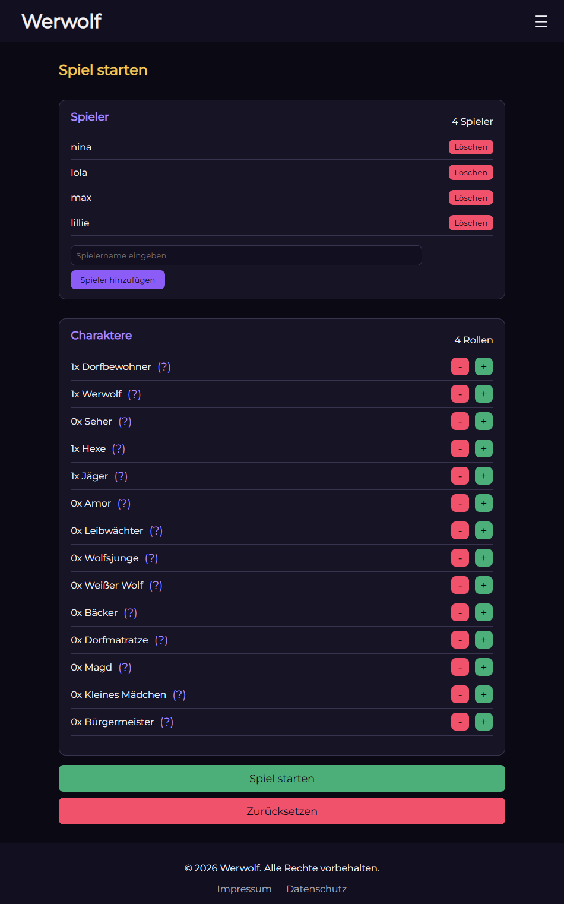
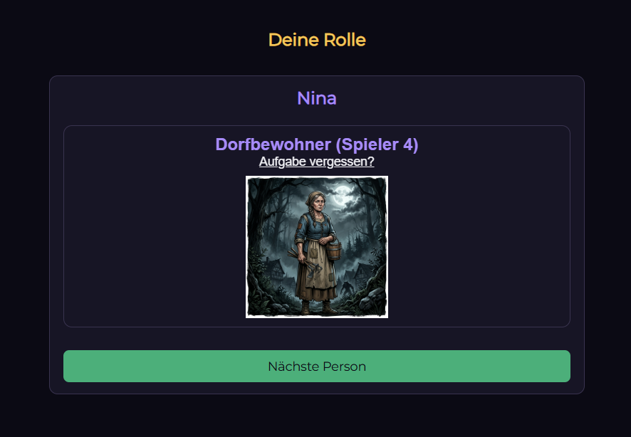
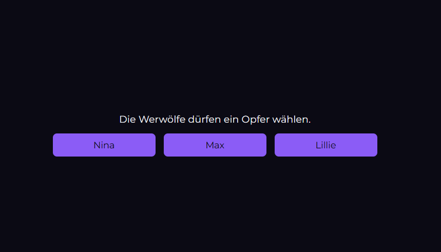
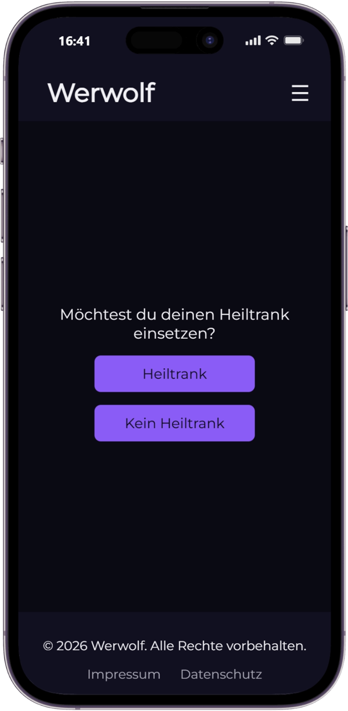

# Werwolf
Werwolf - Spiele deine Rolle. Täusche alle.


<a href="img/icon512_rounded.png"></a>

## Beschreibung
Werwolf ist ein spannendes Partyspiel voller Täuschung, Diskussionen und überraschender Wendungen. Schlüpfe in deine Rolle, finde heraus, wem du vertrauen kannst, und entlarve die Werwölfe, bevor es zu spät ist.


## Funktionen
- Mehr als 10 verschiedene Rollen mit einzigartigen Fähigkeiten und Strategien
- Unterstützung für mehr als 40 Spieler gleichzeitig
- Komplett ohne Erzähler: die Web-App übernimmt die gesamte Spielleitung
- Eine intuitive und übersichtliche Benutzeroberfläche für ein einfaches und zugängliches Spielerlebnis


## Einblicke

<a href="img/docu/main-site.png"></a>
<a href="img/docu/my-role.png"></a>
<a href="img/docu/victim.png"></a>
<a href="img/docu/mobile-view.png"></a>
<a href=""></a>

## Projektstatus

**Letztes Update:** Oktober 2026

## Technologien

In diesem Projekt kommen folgende Technologien und Tools zum Einsatz:

### Frontend:

<p>
  
  
  
</p>

### Text-to-Speech

Die Sprachausgabe funktioniert je nach Gerät auf zwei Wegen:

- **Desktop:** Hier verwendet das Projekt **Supertonic-3** von Supertone Inc.
- **Mobilgeräte (Android/iOS):** Hier wird die in Betriebssystem und Browser eingebaute Sprachausgabe über die **Web Speech API** (`speechSynthesis`) genutzt. Es wird bevorzugt eine deutsche Stimme (`de-DE`) ausgewählt, bei der Qualität zuerst die Stimmen mit „natural“, „neural“ oder „online“ im Namen. Dadurch entfallen Modell-Downloads und lange Ladezeiten, und die Sprachausgabe startet sofort.

#### Supertonic-3 (Desktop)

Die ONNX-Modelle und Konfigurationsdateien werden bei Bedarf direkt von Hugging Face geladen (`Supertone/supertonic-3`, Verzeichnis `onnx`). `helper.js` speichert diese Antworten zusätzlich in der Cache API des Browsers unter `werwolf-tts-v1`, damit sie bei späteren Aufrufen möglichst aus dem lokalen Cache geladen werden können. Das Stimmprofil `M1.json` wird ebenfalls von Hugging Face geladen; es wird im Anwendungscode nicht in diesem Cache abgelegt.

Die TTS-Inferenz und Erzeugung der Audiodaten erfolgen im Browser. Der dafür vorgesehene Text wird nicht an eine TTS-API übermittelt. ONNX Runtime Web wird als JavaScript-Modul von **unpkg.com** geladen. Wenn der Browser WebGPU unterstützt, wird WebGPU verwendet; andernfalls greift ONNX Runtime Web auf WebAssembly (WASM) zurück.

#### Eingebaute Sprachausgabe (Mobilgeräte)

Die Stimmen stammen vom Gerät bzw. Browser und werden nicht vom Projekt mitgeliefert. Welche Stimmen verfügbar sind, hängt vom Gerät ab. Bei Stimmen, die vom Betriebssystem oder Browser als „online“ bzw. „network“ bereitgestellt werden, kann der Text zur Sprachsynthese an den jeweiligen Anbieter (z. B. Google oder Apple) übertragen werden. Das liegt außerhalb der Kontrolle dieses Projekts.

Verwendete Komponenten:

- **Supertonic-3** – Text-to-Speech-Modell von Supertone Inc. (Desktop)
- **ONNX Runtime Web** – Ausführung der ONNX-Modelle im Browser (Desktop)
- **WebGPU** – Hardwarebeschleunigte TTS-Inferenz, sofern verfügbar (Desktop)
- **WebAssembly (WASM)** – Fallback für nicht unterstützte Browser (Desktop)
- **Hugging Face** – Bereitstellung der Modell- und Stimmprofildateien (Desktop)
- **unpkg** – Bereitstellung des ONNX-Runtime-Web-Moduls (Desktop)
- **Web Speech API (`speechSynthesis`)** – Eingebaute Sprachausgabe von Browser und Betriebssystem (Mobilgeräte)

Das Supertonic-3-Modell und die zugehörigen Modellressourcen unterliegen der [BigScience Open RAIL-M License](https://huggingface.co/Supertone/supertonic-3/blob/main/LICENSE).


## Benutzung

**Projekt klonen**

Klone dieses Repository auf deinen lokalen Rechner:

```bash
git clone https://github.com/Nils-Programmierer/Werwolf.git
```

**Website**

Nutze die Web-App direkt über die folgende URL:

[https://nils-programmierer.github.io/Werwolf/](https://nils-programmierer.github.io/Werwolf/)


## Beitragende

- [Nils-Programmierer](https://github.com/Nils-Programmierer)  (Entwickler und Projektleiter)


## Lizenz und Drittanbieterrechte

### Eigener Projektcode

Der eigene Quellcode dieses Projekts ist urheberrechtlich geschützt. Sofern nicht ausdrücklich anders angegeben, gilt dafür die im Repository enthaltene Datei [LICENSE](LICENSE): Alle Rechte vorbehalten. Das öffentliche Einsehen des GitHub-Repositories erteilt keine allgemeine Erlaubnis, den Projektcode zu vervielfältigen, zu verändern oder weiterzuverbreiten.

Diese Rechteangabe gilt nicht für Drittanbieter-Komponenten und Dateien, die eigenen Lizenzbedingungen unterliegen. Die folgenden Hinweise erfassen jeweils nur die genannte Komponente und stellen sie nicht unter die Projekt-Lizenz.

### Supertonic-3-Modell

Die Anwendung lädt die ONNX-Modellgewichte, Konfigurationsdateien und das Stimmprofil `M1.json` zur Laufzeit aus dem [Supertonic-3-Repository von Supertone Inc. auf Hugging Face](https://huggingface.co/Supertone/supertonic-3). Diese Modellressourcen unterliegen der [OpenRAIL-M-Lizenz](https://huggingface.co/Supertone/supertonic-3/blob/main/LICENSE). Bei ihrer Nutzung und Weitergabe sind die Lizenzbedingungen einschließlich der Nutzungsbeschränkungen in Anhang A zu beachten. Die Modellressourcen werden nicht im Repository mitgeliefert.

Das Supertonic-Projekt nennt für seinen Beispielcode die MIT-Lizenz und für das begleitende Modell die OpenRAIL-M-Lizenz. Die MIT-Angabe für den Beispielcode lizenziert weder die Modellgewichte noch den eigenständigen Werwolf-Projektcode. Weitere Einzelheiten stehen in den Lizenzangaben des [Modellprojekts](https://huggingface.co/Supertone/supertonic-3) und des [zugehörigen Quellcode-Repositories](https://github.com/supertone-inc/supertonic).

### Eingebaute Sprachausgabe (Mobilgeräte)

Auf Mobilgeräten nutzt die Anwendung die Web Speech API des Browsers. Die dabei verwendeten Stimmen werden nicht vom Projekt bereitgestellt und unterliegen den Lizenz- und Nutzungsbedingungen des jeweiligen Geräte- bzw. Browserherstellers.

### Bibliotheken und Schriftart

- [ONNX Runtime Web](https://github.com/microsoft/onnxruntime) wird als Modul von unpkg.com geladen und steht unter der MIT-Lizenz. Maßgeblich sind die Lizenz- und Copyright-Hinweise der jeweils ausgelieferten Paketversion.
- Die Schriftart Montserrat in `fonts/Montserrat/` unterliegt der SIL Open Font License 1.1; siehe [fonts/Montserrat/OFL.txt](fonts/Montserrat/OFL.txt).

Weitere zur Laufzeit geladene oder gebündelte Drittanbieter-Komponenten können eigenen Lizenzbedingungen unterliegen. Es gelten die jeweiligen mitgelieferten Lizenz- und Copyright-Hinweise.
